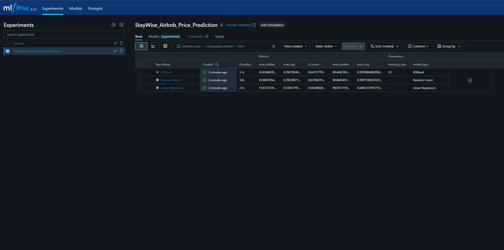
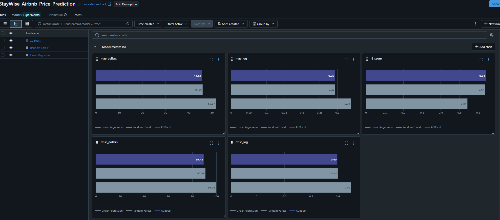
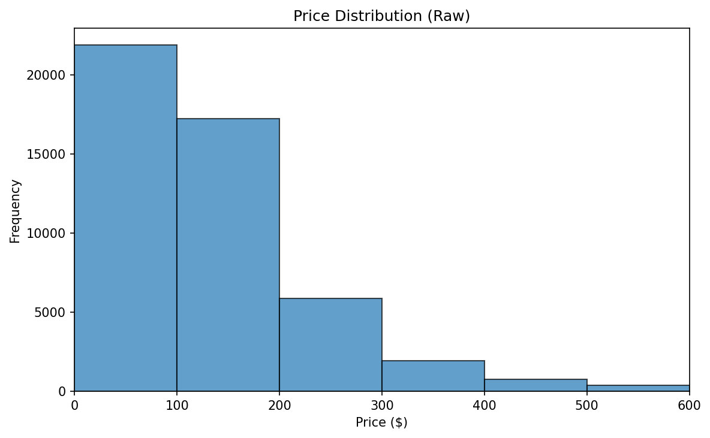
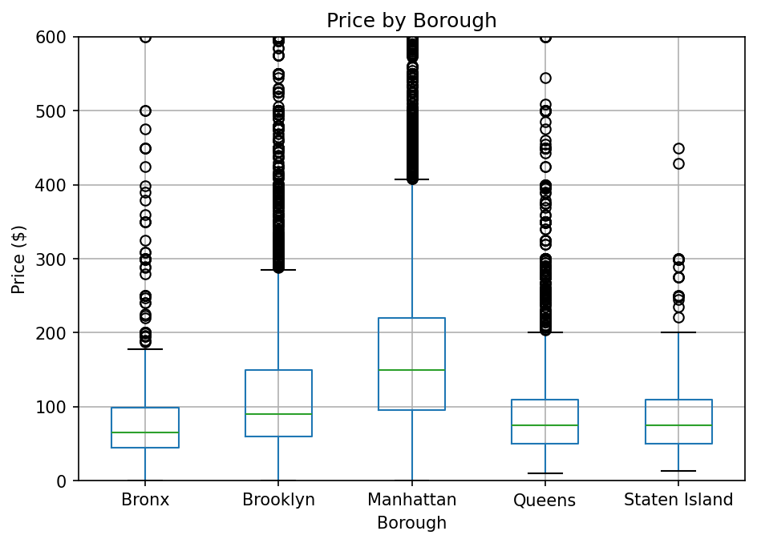
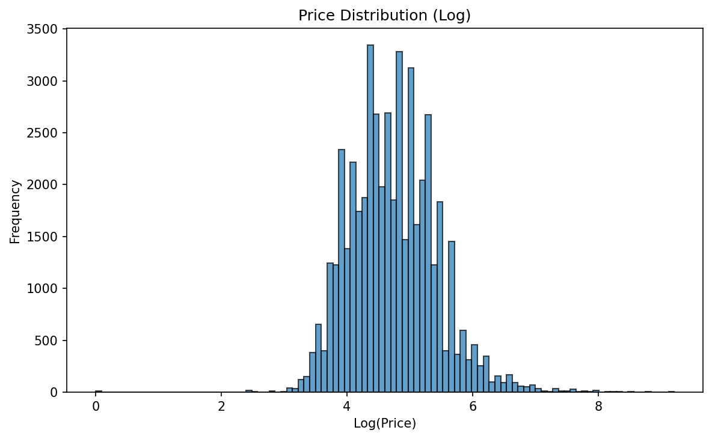
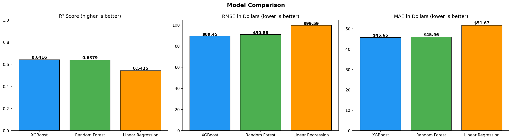
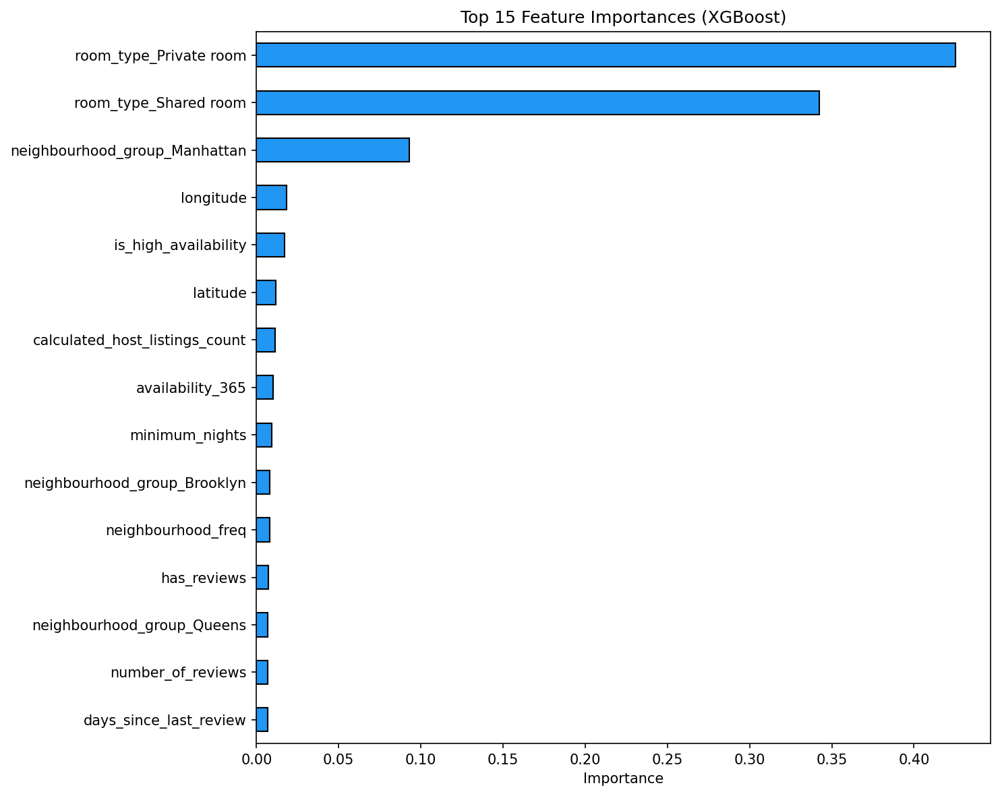
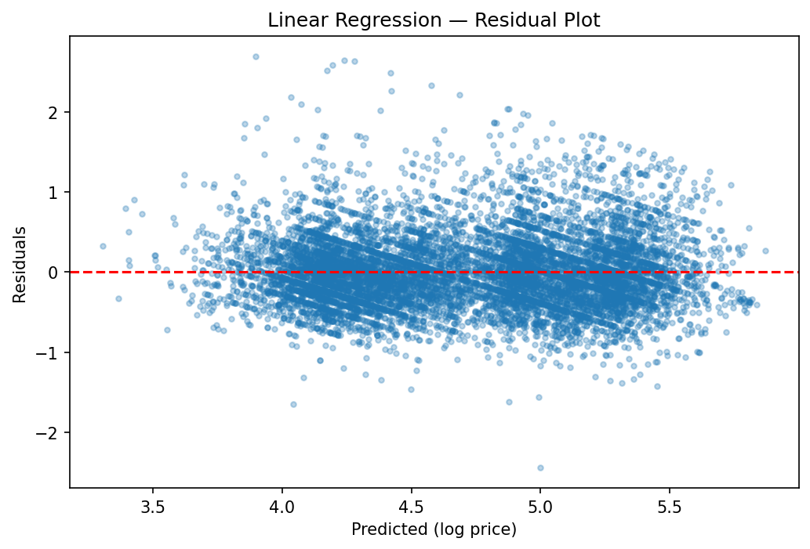
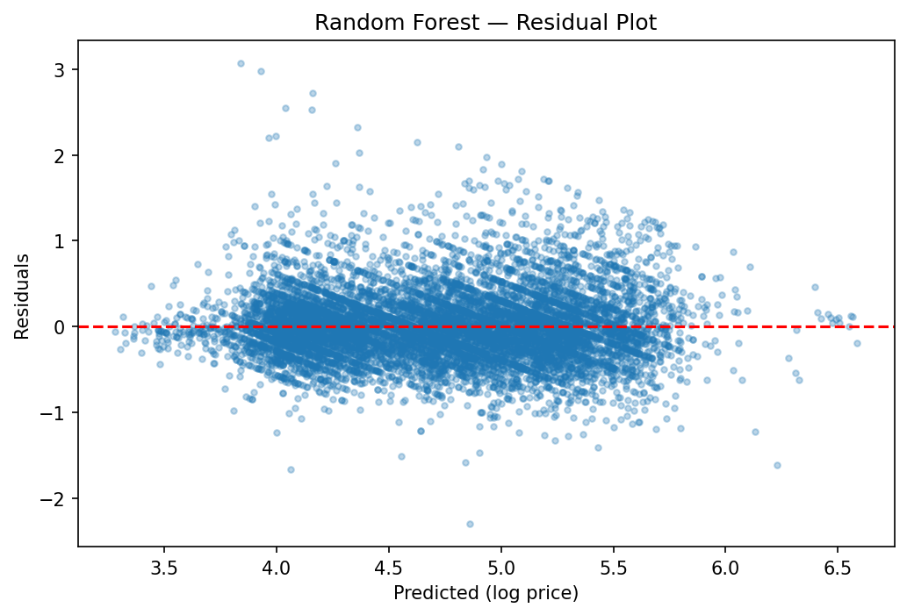
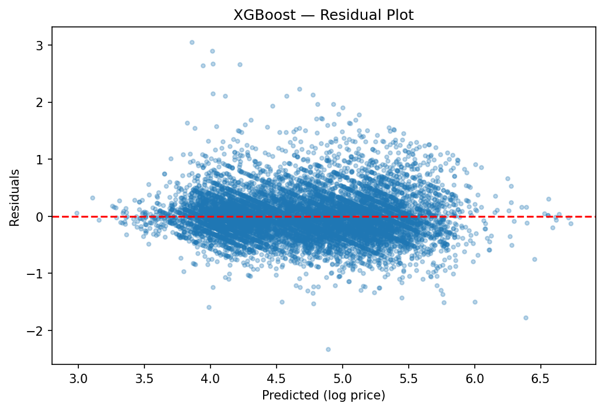

# StayWise — Predicting Airbnb Listing Prices with MLflow & AWS S3

## Project Overview and Objectives

**StayWise** is an end-to-end machine learning project that predicts nightly Airbnb listing prices in New York City. The pipeline covers the full lifecycle — from cloud-based data retrieval through model training to experiment tracking and model registry — using industry-standard MLOps tooling.

### Objectives

- Build a regression pipeline to predict Airbnb nightly prices from listing attributes such as location, room type, availability, and review activity.
- Compare three model architectures (Linear Regression, Random Forest, XGBoost) to identify the best performer.
- Use **AWS S3** for centralized data storage and retrieval.
- Use **MLflow** for experiment tracking, metric logging, artifact storage, and model registry.
- Engineer meaningful features from raw listing data and handle the heavily skewed price distribution via log transformation.

### Dataset

The dataset is the [New York City Airbnb Open Data (2019)](https://www.kaggle.com/datasets/dgomonov/new-york-city-airbnb-open-data), containing **48,895 listings** across NYC's five boroughs with 16 original columns including price, location coordinates, room type, reviews, and availability.

---

## Setup and Execution Instructions

### Prerequisites

- Python 3.9+
- AWS account with configured credentials (`aws configure` or environment variables)
- The following Python packages:

```
pandas
numpy
matplotlib
seaborn
boto3
scikit-learn
xgboost
mlflow
```

### Installation

```bash
# Clone the repository
git clone https://github.com/Nafis671/AML-3303-Assignment-3.git
cd staywise-airbnb-pricing

# Create and activate a virtual environment
python -m venv .mlflow
source .mlflow/bin/activate        # Linux/macOS
.mlflow\Scripts\activate           # Windows

# Install dependencies
pip install -r requirements.txt
```

### Running the Pipeline

1. **Configure AWS credentials** — ensure `AWS_ACCESS_KEY_ID` and `AWS_SECRET_ACCESS_KEY` are set, or run `aws configure`.

2. **Place the dataset** — put `AB_NYC_2019.csv` in the `./data/` directory.

3. **Run the notebook**:

   ```bash
   jupyter notebook airbnb_price_prediction.ipynb
   ```

   Execute all cells sequentially. The notebook will:
   - Create an S3 bucket and upload/download the dataset
   - Clean, preprocess, and engineer features
   - Train three models with full MLflow logging
   - Register the best model in the MLflow Model Registry

4. **Launch the MLflow UI** to inspect experiment runs:
   ```bash
   mlflow server
   ```
   Then open [http://localhost:5000](http://localhost:5000) in your browser.

---

## Repository Structure and Workflow Description

```
staywise-airbnb-pricing/
├── airbnb_price_prediction.ipynb   # Main notebook (full pipeline)
├── data/
│   ├── AB_NYC_2019.csv             # Raw dataset
│   └── Ab Nyc2019 Data Dictionary.docx
├── downloaded/                     # S3 download destination
│   └── AB_NYC_2019.csv
├── figures/                        # Generated plots and artifacts
│   ├── eda_price_raw.png
│   ├── eda_price_by_borough.png
│   ├── eda_price_log.png
│   ├── residuals_linear_regression.png
│   ├── residuals_random_forest.png
│   ├── residuals_xgboost.png
│   ├── model_comparison.png
│   └── feature_importance.png
├── mlruns/                         # MLflow tracking directory
├── requirements.txt
└── README.md
```

### Workflow

The pipeline follows six stages:

**Stage 1 — Data Retrieval (AWS S3):** An S3 bucket (`aml-3303-airbnb-nyc-2019-listing`) is created in `us-east-2`. The raw CSV and data dictionary are uploaded, then the CSV is downloaded locally for processing.

**Stage 2 — Exploratory Data Analysis:** The raw price distribution is visualized (heavily right-skewed, median \$106, max \$10,000). Borough-level box plots reveal Manhattan's premium pricing. A log transformation is applied to normalize the target.

**Stage 3 — Data Cleaning & Preprocessing:**

- Rows with `price = 0` are removed (11 invalid listings).
- Missing `reviews_per_month` values are filled with 0.
- Outliers are capped at the 99.5th percentile for price (\$1,000) and 99th percentile for minimum nights (45).
- Final cleaned shape: **48,198 rows × 19 features**.

**Stage 4 — Feature Engineering:**

- `has_reviews` — binary flag for review activity.
- `days_since_last_review` — recency of engagement (−1 if never reviewed).
- `is_high_availability` — available more than half the year.
- `is_multi_lister` — host manages multiple listings.
- `neighbourhood_freq` — frequency encoding for 221 unique neighbourhoods.
- One-hot encoding for `room_type` and `neighbourhood_group`.
- Numerical features are standardized with `StandardScaler`.

**Stage 5 — Model Training & MLflow Tracking:** Three models are trained on an 80/20 split (38,558 train / 9,640 test) under the MLflow experiment `StayWise_Airbnb_Price_Prediction`. Each run logs parameters, metrics (R², RMSE, MAE on both log and dollar scales), the trained model artifact, and a residual plot.

**Stage 6 — Model Registration:** The best model (XGBoost) is registered in the MLflow Model Registry as `StayWise_Price_Predictor` and assigned the `production` alias.

---

## MLflow UI Screenshots

### Experiment Runs Overview

The MLflow Experiments page shows all three runs under `StayWise_Airbnb_Price_Prediction`, each with logged parameters (hyperparameters, model type, sample counts) and metrics.



### Metrics Comparison

The MLflow UI allows side-by-side comparison of R² Score, RMSE, and MAE across all three models. XGBoost and Random Forest are nearly tied, both substantially outperforming Linear Regression.



---

## Exploratory Data Analysis

### Raw Price Distribution



The vast majority of listings fall under \$100, with a steep drop-off through the \$100–\$200 range. Beyond \$300, listings become extremely rare. This heavy right skew motivates the log transformation.

### Price by Borough



Manhattan dominates with a median around \$150 — nearly double every other borough. Brooklyn follows at ~\$90. The Bronx, Queens, and Staten Island cluster together at \$65–\$75.

### Log-Transformed Price Distribution



After applying `log1p`, the distribution approximates a bell curve, which is far better suited for regression modeling.

---

## Model Results

### Comparison Table

| Model             | R² Score | RMSE (log) | MAE (log) | RMSE (\$) | MAE (\$) |
| ----------------- | -------- | ---------- | --------- | --------- | -------- |
| **XGBoost**       | 0.6416   | 0.3977     | 0.2928    | \$89.45   | \$45.65  |
| Random Forest     | 0.6379   | 0.3998     | 0.2933    | \$90.86   | \$45.96  |
| Linear Regression | 0.5425   | 0.4493     | 0.3385    | \$99.59   | \$51.67  |

### Visual Comparison



### Feature Importance (XGBoost)



### Residual Plots

|                    Linear Regression                     |                    Random Forest                     |                     XGBoost                     |
| :------------------------------------------------------: | :--------------------------------------------------: | :---------------------------------------------: |
|  |  |  |

---

## Key Insights and Observations

### Data Insights

- The dataset spans **48,895 listings** across NYC's five boroughs, with Manhattan and Brooklyn representing the majority.
- The price distribution is heavily right-skewed (median \$106, maximum \$10,000). Applying a log transformation normalized the target and improved model performance.
- Approximately **20.5%** of listings have never been reviewed, resulting in missing `last_review` and `reviews_per_month` values. These were handled by filling with 0 and encoding a `has_reviews` flag.
- Only **11 listings** had a price of \$0 — likely erroneous entries that were removed.

### Modeling Insights

- **Room type** and **location** (latitude, longitude, borough) are the strongest price predictors, confirming that geography and listing category drive NYC Airbnb pricing.
- Tree-based models (Random Forest and XGBoost) significantly outperform Linear Regression (R² of ~0.64 vs. 0.54), indicating **non-linear relationships** between features and price.
- XGBoost edges out Random Forest by a narrow margin (R² 0.6416 vs. 0.6379), suggesting diminishing returns from added model complexity for this feature set.
- The residual plots show all models struggle with high-end listings, where variance is inherently higher and predictive signal is weaker.
